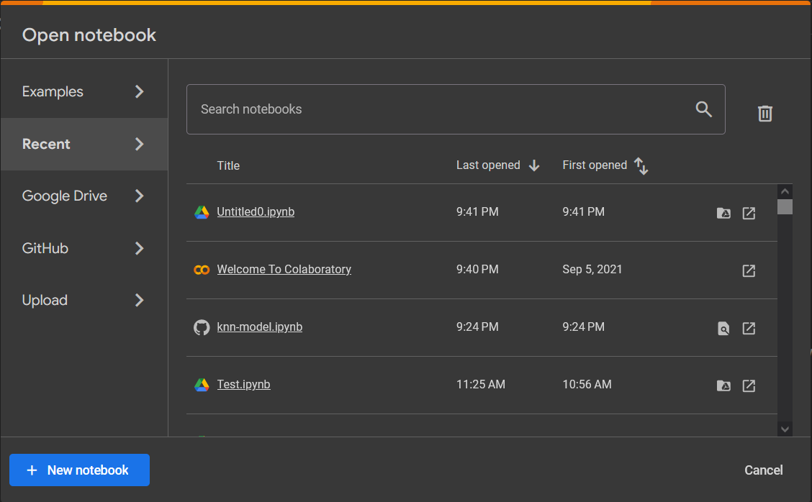
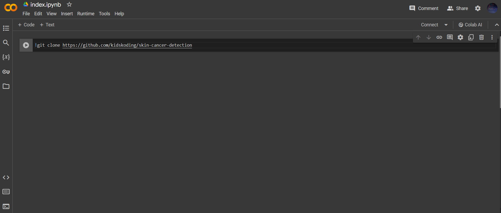
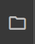

# skin-cancer-detection docs

## Skin Cancer

Skin Cancer is a type of cancer where 
abnormal skin cells rapidly grow. It occurs due to 
skin receiving massive exposure to UV-ultraviolet rays. 
1 in 3 patients today experience this phenomenon, and many cases still remain undetected today.

## Installation and setup

### Please read the following: 

This project must run on . It requires the Google Colab libraries and cannot run without them installed!

#### This means that running the Jupyter Notebooks on a local IDE or a Jupyter Notebook server will not work

Open Google Colab ! You should be greeted with an screen that looks like one shown below.

Click on "New notebook" (the blue button on the bottom left hand corner) and edit the title it index.ipynb!

Copy and paste the cell in  into the first cell of the new 
Google Colab notebook you just created. This should look like the image below

Go ahead and run this cell! 

Now you will have the entire project available to run the code on Google Colab!
You can view the entire project by clicking the folder icon on the left hand corner.

Double click .ipynb files to view them and run the cells!