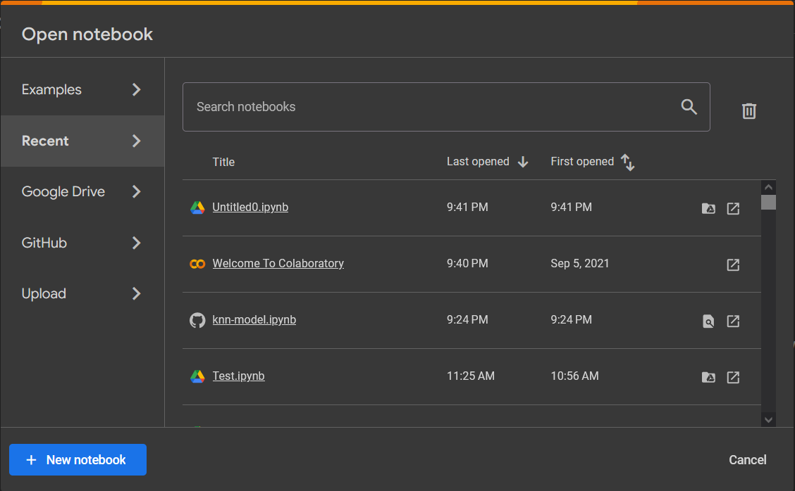
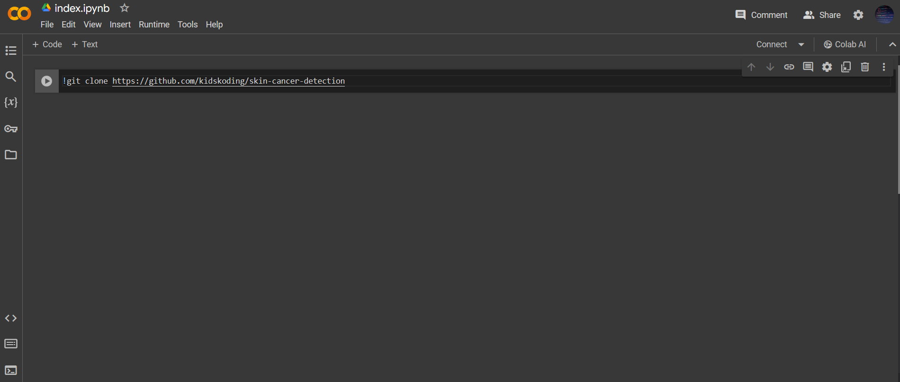
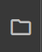

# skin-cancer-detection docs

## Background - Skin Cancer

Skin Cancer is a type of cancer where 
abnormal skin cells rapidly grow. It occurs due to 
skin receiving massive exposure to UV-ultraviolet rays. 
1 in 3 patients today experience this phenomenon, and many cases still remain undetected today.

## Approach - A Skin Care Detection AI and ML algorithm

To combat the excessive spread in skin cancer, I created a series of Artificial Intelligence (AI) and Machine Learning (ML) algorithms 
to detect skin cancer within humans!

## Important Information

### Please read the following:

- This project must run on . It requires the Google Colab libraries and cannot run without them installed!
- #### This means that running the Jupyter Notebooks on a local IDE or any server, other than Google Colab, will not work

The source code of this project is split up into two files: <strong>ml-models.ipynb</strong> and <strong>ml-models.py!</strong>
- <strong>ml-models.ipynb</strong>: This is the .ipynb file to run in Google Colab! Please run this file ONLY in Google Colab! 
This project requires dependencies that only Google Colab is able to recognize
- <strong>ml-models.py</strong>: This is the .py file that corresponds with the .ipynb file!
  - This .py file is for GitHub source-code viewing purposes! 
  - <strong>PLEASE DO NOT THIS FILE RUN ANYWHERE, INCLUDING GOOGLE COLAB! RUN THE ml-models.ipynb file INSTEAD!</strong>

## Installation and Setup

Open Google Colab ! You should be greeted with an screen that looks like one shown below.

Click on "New notebook" (the blue button on the bottom left hand corner) and edit the title to index.ipynb!

COPY AND PASTE THE FOLLOWING IN THE FIRST CELL:

<code>!git clone https://www.github.com/kidskoding/skin-cancer-detection.git</code>

You can also view it in the index.ipynb file within this repo!

The result should look like something below!

Go ahead and run this cell! 

Now you will have the entire project available to run the code on Google Colab! 
You can view the entire project by clicking the folder icon on the left hand corner.

#### Double-click the ml-models.ipynb file run the code cells!

#### ONCE AGAIN PLEASE REFRAIN FROM RUNNING THE ml-models.py file! PLEASE USE the ml-models.ipynb file in Google Colab instead to run cells!

Thank you for your cooperation!